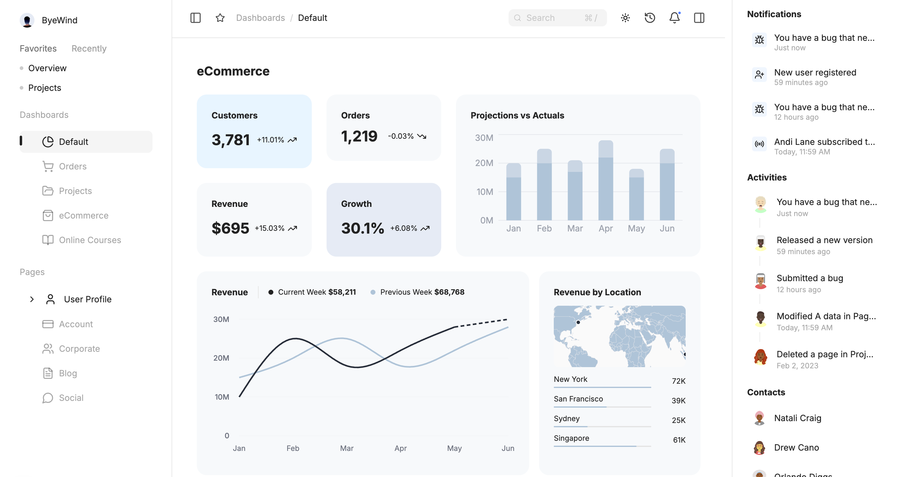
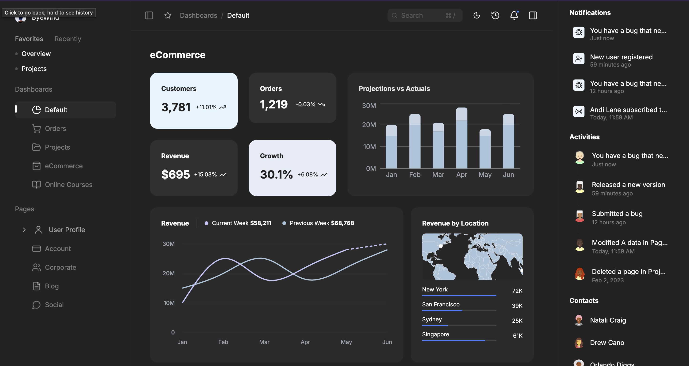
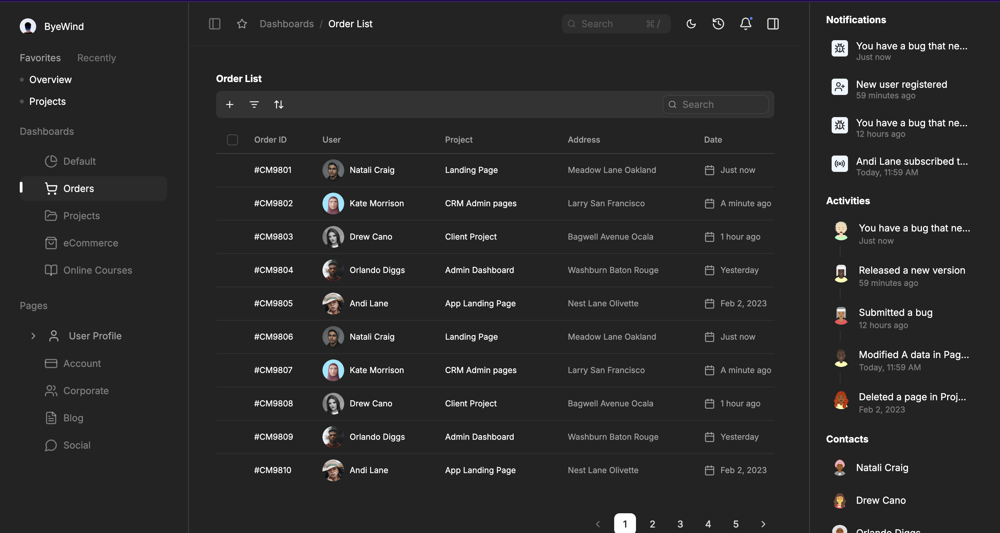

# SaaS Dashboard - Juspay UI Assignment

A modern, responsive SaaS dashboard built with Next.js, React, TypeScript, and Tailwind CSS. This project implements a pixel-perfect eCommerce dashboard with advanced features including dark/light theme, filtering, sorting, pagination, and smooth animations.

## 📸 Screenshots

### Dashboard Home - Light Mode



### Dashboard Home - Dark Mode



### Order List - Light Mode


### Order List - Dark Mode



## 🚀 Live Demo

**Deployed Application:**

## ⚡ Working Features

### 🎯 Priority Features (Fully Functional)

#### **Left Drawer Navigation**

- ✅ **Favorites Feature**: Add/remove up to 2 favorite pages with star icon
- ✅ **Recent Pages**: Auto-tracked navigation history (last 2 pages)
- ✅ **Dashboard Navigation**:
  - Default Dashboard (working)
  - Order List (working)
  - Projects (working)
  - eCommerce (placeholder)
  - Online Courses (placeholder)
- ✅ **Auto-Close on Mobile**: Drawer closes when menu item clicked on mobile
- ✅ **Swipe Gestures**: Open/close with swipe on mobile devices

#### **Header Features**

- ✅ **Cmd+/ Search**: Keyboard shortcut to focus search bar (Cmd+/ or Ctrl+/)
- ✅ **Recent History Icon**: Click to open left drawer with recent pages highlighted
- ✅ **Notification Icon**: Click to open right drawer with notifications highlighted
- ✅ **Theme Toggle**: Seamless dark/light mode switching with persistence
- ✅ **Dynamic Breadcrumbs**: Auto-updating navigation trail based on current route

#### **Drawer System**

- ✅ **Left Sidebar Toggle**: Open/close left navigation drawer
- ✅ **Right Sidebar Toggle**: Open/close right tools/notifications drawer
- ✅ **Redux Persistence**: Drawer states saved to localStorage
- ✅ **Responsive Behavior**: Auto-close on mobile, stay open on desktop
- ✅ **Smooth Animations**: GSAP-powered slide/fade transitions

#### **Charts & Visualizations**

- ✅ **Total Sales Donut Chart**: Custom color scheme with legend
- ✅ **Revenue by Location Map**: Interactive bar chart with country flags
- ✅ **Revenue Line Chart**: Current vs previous week comparison
- ✅ **Projections vs Actuals**: Bar chart with dual data series
- ✅ **Metric Cards**: Customers, Orders, Revenue, Growth with trend indicators

#### **Order List Page - Complete Data Table**

- ✅ **Copy on Hover**:
  - Order ID: Click to copy with visual feedback
  - Address: Hover to show copy icon, click to copy
- ✅ **Row Hover Effects**: Border radius and background color change on hover
- ✅ **Multi-Status Filter**:
  - Checkbox selection (multi-select)
  - Visual badge showing active filter count
  - Filter by: In Progress, Complete, Pending, Approved, Rejected
- ✅ **Global Search**:
  - Real-time search across all columns
  - Clear button appears when text entered
  - Debounced for performance
- ✅ **Multi-Column Sorting**:
  - Dropdown menu with radio selection (single-select)
  - Sort by: Date (newest/oldest), User (A-Z/Z-A), Status (A-Z/Z-A)
  - Visual indicators (arrows) for active sort
  - "None" option to clear sorting
- ✅ **Pagination**:
  - Items per page selector (10, 20, 30, 40, 50)
  - Previous/Next navigation
  - Current page number display
  - Total items count
  - Page X of Y indicator
- ✅ **Clear Filters Button**: Resets all filters, search, and sorting
- ✅ **Empty State Handling**: Smart detection with reset options
- ✅ **Avatar Display**: Next.js Image with local SVG avatars (6 unique avatars cycling)

### 🎨 UI/UX Features

#### **Theming**

- ✅ Dark/Light mode toggle in header
- ✅ System preference detection
- ✅ Smooth transitions between themes
- ✅ Persistence across sessions
- ✅ All components theme-aware

#### **Responsive Design**

- ✅ Mobile (<768px): Stacked layout, hamburger menu, touch-friendly
- ✅ Tablet (768-1024px): 2-column layout, comfortable spacing
- ✅ Desktop (>1024px): Full multi-column layout, all features visible

#### **Animations & Microinteractions**

- ✅ Page transitions with Framer Motion
- ✅ Hover effects on buttons and cards
- ✅ Loading states and skeletons
- ✅ Smooth drawer animations with GSAP
- ✅ Chart animations on load
- ✅ Button ripple effects

### 📊 Data Features

#### **Orders Table**

- ✅ 50 mock orders with realistic data
- ✅ 6 unique SVG avatars cycling through users
- ✅ Status badges with color coding
- ✅ Sortable columns (Date, User, Status)
- ✅ Filterable by status (multi-select)
- ✅ Searchable across all fields
- ✅ Paginated display

#### **Dashboard Metrics**

- ✅ Real-time KPI cards (Customers, Orders, Revenue, Growth)
- ✅ Trend indicators (up/down arrows with percentages)
- ✅ Revenue data (current vs previous week)
- ✅ Projections vs Actuals comparison
- ✅ Sales distribution by category
- ✅ Revenue by geographic location

### 🔧 Technical Features

#### **State Management**

- ✅ Redux Toolkit with Redux Persist
- ✅ Three slices: UI, Favorites, Navigation
- ✅ Automatic localStorage persistence
- ✅ Memoized selectors for performance
- ✅ Type-safe with TypeScript

#### **Performance**

- ✅ Code splitting with dynamic imports
- ✅ Lazy loading for heavy components
- ✅ Debounced search and resize handlers
- ✅ Memoized components and callbacks
- ✅ Next.js Image optimization
- ✅ Static avatar imports for build-time optimization

#### **Developer Experience**

- ✅ Full TypeScript coverage
- ✅ ESLint configuration
- ✅ Path aliases (@/\*)
- ✅ Modular component structure
- ✅ Reusable custom hooks
- ✅ SOLID principles

### 🎮 Interactive Features

- ✅ **Keyboard Shortcuts**: Cmd+/ for search focus
- ✅ **Escape Key**: Close drawers
- ✅ **Swipe Gestures**: Mobile drawer control
- ✅ **Click to Copy**: Order IDs and addresses
- ✅ **Hover States**: All interactive elements
- ✅ **Focus States**: Keyboard navigation support
- ✅ **Touch Targets**: 44x44px minimum on mobile

### 📱 Mobile-Specific Features

- ✅ Drawers auto-close on load
- ✅ Drawers auto-close on navigation
- ✅ Body scroll lock when drawer open
- ✅ Touch-friendly controls
- ✅ Horizontal scroll for tables
- ✅ Stacked toolbar controls
- ✅ Optimized spacing and typography

## 📋 Table of Contents

- [⚡ Working Features](#-working-features) ⭐ **START HERE**
- [Screenshots](#-screenshots)
- [Live Demo](#-live-demo)
- [Features](#-features)
- [Tech Stack](#️-tech-stack)
- [Getting Started](#-getting-started)
- [Project Structure](#-project-structure)
- [Redux State Management](#-redux-state-management)
- [Acknowledgments](#-acknowledgments)

## ✨ Features

### Core Functionality

- ✅ **Multiple Dashboard Views**: Default, eCommerce, Projects, Order List
- ✅ **Dark/Light Theme**: Seamless theme switching with persistence
- ✅ **Responsive Design**: Mobile-first approach, works on all devices (< 768px, 768-1024px, > 1024px)
- ✅ **Advanced Data Table**: Complete CRUD operations with TanStack Table
  - **Filtering**: Multi-status filtering with visual badges
  - **Search**: Real-time global search with debouncing and clear button
  - **Sorting**: Multi-column sorting (date, user, status) with dropdown menu
  - **Pagination**: Items per page selector, page navigation, total count
  - **Empty States**: Smart detection of filters/search with reset options
- ✅ **Dynamic Breadcrumbs**: Auto-updating breadcrumbs based on current route
- ✅ **Smart Drawer System**: Auto-closes on mobile, stays open on desktop
- ✅ **Image Optimization**: Next.js Image with local SVG avatars

### UI Components

- 📊 **Interactive Charts**: Revenue trends, projections vs actuals, sales distribution (Recharts)
- 📈 **Metric Cards**: Real-time KPI tracking with trend indicators and animations
- 📋 **Advanced Data Tables**:
  - TanStack Table with full feature set
  - Sortable columns with visual indicators
  - Multi-filter support with badges
  - Global search with instant clear
  - Pagination with customizable page size
  - Empty state handling with reset actions
  - Avatar display with Next.js Image optimization
- 🗺️ **Location Map**: Revenue by geographic location with visual bars
- 🔔 **Notifications Panel**: Real-time notification system in right drawer
- 👥 **Activity Feed**: User activity tracking with timestamps
- 💬 **Contacts List**: Contact management with online/offline/away status
- 🎯 **Dynamic Breadcrumbs**: Route-aware navigation trail
- 📱 **Responsive Drawers**: Mobile-optimized with auto-close on navigation

### Animations & Microinteractions

- 🎨 **Smooth Transitions**: Page and component transitions
- ⚡ **Hover Effects**: Interactive button and card states
- 🌊 **Loading States**: Skeleton loaders and spinners
- 🎭 **Framer Motion**: Advanced animation library integration
- ✨ **Microinteractions**: Delightful user feedback

## 🛠️ Tech Stack

### Core

- **Framework**: [Next.js 16](https://nextjs.org/) (App Router)
- **Language**: [TypeScript](https://www.typescriptlang.org/)
- **UI Library**: [React 18.3.1](https://react.dev/)

### Styling & UI

- **CSS Framework**: [Tailwind CSS 4](https://tailwindcss.com/)
- **Icons**: [Lucide React](https://lucide.dev/)
- **Animations**: [Framer Motion](https://www.framer.com/motion/) + [Motion](https://motion.dev/) + [GSAP](https://gsap.com/)
- **UI Components**: [Radix UI](https://www.radix-ui.com/) + [Base UI](https://base-ui.com/)

### Data Visualization

- **Charts**: [Recharts](https://recharts.org/) + [Chart.js](https://www.chartjs.org/)
- **Maps**: [react-simple-maps](https://www.react-simple-maps.io/)
- **Tables**: [TanStack Table](https://tanstack.com/table/latest)

### State Management

- **Global State**: [Redux Toolkit](https://redux-toolkit.js.org/) with [Redux Persist](https://github.com/rt2zz/redux-persist)
- **Theme**: [next-themes](https://github.com/pacocoursey/next-themes) (React Context API)

### Utilities

- **Class Merging**: clsx + tailwind-merge
- **Date Formatting**: date-fns

### Development Tools

- **Linting**: ESLint
- **Type Checking**: TypeScript
- **Testing**: Jest + React Testing Library
- **Formatting**: Prettier
- **Package Manager**: npm

## 🚀 Getting Started

### Prerequisites

- Node.js 18+ and npm/yarn/pnpm

### Installation

1. **Clone the repository**

```bash
git clone https://github.com/sonic-sabers/juspay-ui.git
cd juspay-ui
```

2. **Install dependencies**

```bash
npm install
# or
yarn install
# or
pnpm install
```

3. **Run the development server**

```bash
npm run dev
# or
yarn dev
# or
pnpm dev
```

4. **Open your browser**
   Navigate to [http://localhost:3000](http://localhost:3000)

### Build for Production

```bash
npm run build
npm run start
```

### Other Commands

```bash
# Lint code
npm run lint

# Format code
npm run format

# Run all tests
npm test

# Run tests in watch mode
npm run test:watch

# Run tests with coverage
npm run test:coverage

# Run specific test file
npm test -- MenuItem.test.tsx
```

## 📁 Project Structure

```
juspay-ui/
├── src/
│   ├── app/                          # Next.js App Router
│   │   ├── dashboard/                # Dashboard routes
│   │   │   ├── page.tsx             # Main dashboard page
│   │   │   ├── layout.tsx           # Dashboard layout wrapper
│   │   │   ├── not-found.tsx        # 404 page for dashboard
│   │   │   └── order-list/          # Order list page
│   │   ├── layout.tsx               # Root layout with providers
│   │   ├── page.tsx                 # Home page (redirects to dashboard)
│   │   ├── not-found.tsx            # Global 404 page
│   │   └── globals.css              # Global styles
│   │
│   ├── components/                   # React components
│   │   ├── ui/                      # Reusable UI components (buttons, cards, etc.)
│   │   ├── animate-ui/              # Animation components
│   │   │   ├── components/          # Animated component implementations
│   │   │   └── primitives/          # Animation primitives
│   │   ├── examples/                # Example/demo components
│   │   │   └── ReduxExample.tsx     # Redux usage demonstration
│   │   ├── navigation/              # Navigation components
│   │   │   ├── NavigationTracker.tsx # Tracks route changes
│   │   │   └── RecentNavigation.tsx  # Recent navigation UI
│   │   ├── theme-provider.tsx       # Theme context provider
│   │   └── theme-toggle.tsx         # Theme switcher component
│   │
│   ├── lib/                         # Core libraries and configurations
│   │   └── redux/                   # Redux Toolkit setup
│   │       ├── store.ts             # Store configuration with persistence
│   │       ├── StoreProvider.tsx    # Redux Provider wrapper
│   │       ├── hooks.ts             # Typed Redux hooks
│   │       ├── index.ts             # Central export file
│   │       ├── slices/              # Redux slices (state + actions)
│   │       │   ├── uiSlice.ts       # UI state (sidebars, theme, etc.)
│   │       │   ├── favoritesSlice.ts # Favorite pages (max 2)
│   │       │   └── navigationSlice.ts # Navigation history
│   │       └── selectors/           # Memoized selectors
│   │           ├── uiSelectors.ts
│   │           ├── favoritesSelectors.ts
│   │           └── navigationSelectors.ts
│   │
│   ├── hooks/                       # Custom React hooks
│   ├── types/                       # TypeScript type definitions
│   ├── data/                        # Mock data and constants
│   └── utils/                       # Helper functions
│
├── public/                          # Static assets
└── [config files]                   # package.json, tsconfig.json, etc.
```

## 🔄 Redux State Management

### Architecture Overview

The application uses **Redux Toolkit** with **Redux Persist** for robust, type-safe state management with automatic localStorage persistence.

### Store Configuration

**Location**: `src/lib/redux/store.ts`

```typescript
// Store features:
- Redux Toolkit for modern Redux patterns
- Redux Persist for automatic state persistence
- Type-safe with full TypeScript support
- Configured for Next.js App Router
- DevTools enabled in development
```

**Key Features**:

- ✅ Automatic persistence to localStorage
- ✅ Hydration handling for SSR
- ✅ Type-safe throughout
- ✅ Optimized middleware configuration
- ✅ Dev tools integration

### State Slices

#### 1. **UI Slice** (`uiSlice.ts`)

Manages global UI state and preferences.

**State**:

```typescript
{
  leftSidebarOpen: boolean; // Left sidebar visibility
  rightSidebarOpen: boolean; // Right sidebar visibility
  leftSidebarWidth: number; // Left sidebar width (200-400px)
  rightSidebarWidth: number; // Right sidebar width (280-480px)
  theme: "light" | "dark" | "system"; // Theme preference
  compactMode: boolean; // Compact view mode
  notificationsPanelOpen: boolean; // Notifications panel state
}
```

**Actions**:

- `toggleLeftSidebar()` / `setLeftSidebarOpen(boolean)`
- `toggleRightSidebar()` / `setRightSidebarOpen(boolean)`
- `setLeftSidebarWidth(number)` / `setRightSidebarWidth(number)`
- `setTheme('light' | 'dark' | 'system')`
- `toggleCompactMode()` / `setCompactMode(boolean)`
- `toggleNotificationsPanel()` / `setNotificationsPanelOpen(boolean)`
- `resetUIState()`

#### 2. **Favorites Slice** (`favoritesSlice.ts`)

Manages user's favorite pages (maximum 2 pages).

**State**:

```typescript
{
  items: FavoritePage[]         // Array of favorite pages (max 2)
  maxFavorites: number          // Maximum allowed favorites (default: 2)
}

interface FavoritePage {
  id: string                    // Unique identifier
  name: string                  // Display name
  path: string                  // Route path
  icon?: string                 // Icon name (Lucide)
  addedAt: number               // Timestamp
}
```

**Actions**:

- `addFavorite(page)` - Add favorite (auto-removes oldest if at max)
- `removeFavorite(id)` - Remove by ID
- `toggleFavorite(page)` - Add if not exists, remove if exists
- `swapFavorites()` - Swap positions of two favorites
- `updateFavorite({ id, updates })` - Update favorite properties
- `resetToDefaults()` - Reset to Overview and Projects
- `setMaxFavorites(number)` - Change max limit

#### 3. **Navigation Slice** (`navigationSlice.ts`)

Tracks navigation history and breadcrumbs.

**State**:

```typescript
{
  currentPath: string           // Current route path
  previousPath: string | null   // Previous route path
  history: NavigationHistoryItem[]  // Navigation history (max 2 items)
  maxHistorySize: number        // Max history items (default: 2)
  breadcrumbs: BreadcrumbItem[] // Breadcrumb trail
  activeSection: string | null  // Active section identifier
}

interface NavigationHistoryItem {
  id: string                    // Unique ID
  path: string                  // Route path
  title: string                 // Page title
  timestamp: number             // Visit timestamp
  params?: Record<string, string>     // Route params
  metadata?: { icon?: string, category?: string }
}
```

**Actions**:

- `navigateTo({ path, title, params?, metadata? })` - Track navigation
- `goBack()` - Navigate to previous path
- `clearHistory()` - Clear all history
- `removeFromHistory(id)` - Remove specific item
- `clearOldHistory(days)` - Remove items older than X days
- `setBreadcrumbs(items)` / `addBreadcrumb(item)` / `removeBreadcrumb(index)`
- `clearBreadcrumbs()`
- `setActiveSection(section)` - Set active section
- `setMaxHistorySize(number)` - Change max history size
- `resetNavigation()` - Reset to initial state

### Selectors

**Memoized selectors** for optimal performance using `createSelector` from Redux Toolkit.

**UI Selectors** (`uiSelectors.ts`):

- `selectLeftSidebarOpen`, `selectRightSidebarOpen`
- `selectLeftSidebarWidth`, `selectRightSidebarWidth`
- `selectTheme`, `selectCompactMode`, `selectNotificationsPanelOpen`
- `selectSidebarsState` - Composite sidebar state
- `selectContentAreaWidth` - Calculated content width

**Favorites Selectors** (`favoritesSelectors.ts`):

- `selectAllFavorites`, `selectFavoritesCount`
- `selectFirstFavorite`, `selectSecondFavorite`
- `selectIsFavorited(id)`, `selectFavoriteById(id)`
- `selectCanAddMoreFavorites`, `selectFavoritesAtMax`
- `selectFavoritesSortedByName`

**Navigation Selectors** (`navigationSelectors.ts`):

- `selectCurrentPath`, `selectPreviousPath`
- `selectNavigationHistory`, `selectRecentHistory(limit)`
- `selectBreadcrumbs`, `selectActiveSection`
- `selectCanGoBack`, `selectHistoryCount`
- `selectHistoryGroupedByDate` - Today, yesterday, older

### Usage Example

```typescript
"use client";

import { useAppDispatch, useAppSelector } from "@/lib/redux";
import {
  toggleLeftSidebar,
  selectLeftSidebarOpen,
  addFavorite,
  selectAllFavorites,
} from "@/lib/redux";

export function MyComponent() {
  const dispatch = useAppDispatch();

  // Select state
  const sidebarOpen = useAppSelector(selectLeftSidebarOpen);
  const favorites = useAppSelector(selectAllFavorites);

  // Dispatch actions
  const handleToggle = () => {
    dispatch(toggleLeftSidebar());
  };

  const handleAddFavorite = () => {
    dispatch(
      addFavorite({
        id: "my-page",
        name: "My Page",
        path: "/my-page",
        icon: "Star",
      })
    );
  };

  return (
    <div>
      <button onClick={handleToggle}>
        Sidebar: {sidebarOpen ? "Open" : "Closed"}
      </button>
      <button onClick={handleAddFavorite}>
        Add Favorite ({favorites.length}/2)
      </button>
    </div>
  );
}
```

### Provider Setup

**Location**: `src/app/layout.tsx`

The Redux store is provided at the root level:

```typescript
<StoreProvider>
  <NavigationTracker /> {/* Auto-tracks route changes */}
  <ThemeProvider>{children}</ThemeProvider>
</StoreProvider>
```

**NavigationTracker**: Automatically tracks route changes and updates navigation state using Next.js `usePathname()` hook.

### Persistence

**Storage**: localStorage (browser)

**Persisted Slices**:

- ✅ UI state (theme, sidebar preferences)
- ✅ Favorites (user's favorite pages)
- ✅ Navigation history (recent pages)

**Hydration**: Handled by `PersistGate` component - shows loading state until state is rehydrated from storage.

### Type Safety

All Redux code is fully typed:

```typescript
// Typed hooks (use these instead of plain useDispatch/useSelector)
export const useAppDispatch = useDispatch.withTypes<AppDispatch>();
export const useAppSelector = useSelector.withTypes<RootState>();
export const useAppStore = useStore.withTypes<AppStore>();

// Type exports
export type RootState = ReturnType<typeof rootReducer>;
export type AppDispatch = AppStore["dispatch"];
export type AppStore = ReturnType<typeof makeStore>;
```

### Key Dependencies

```json
{
  "@reduxjs/toolkit": "^2.11.0",
  "react-redux": "^9.2.0",
  "redux-persist": "^6.0.0",
  "next": "16.0.6",
  "react": "18.3.1",
  "react-dom": "19.2.0",
  "framer-motion": "^11.11.17",
  "motion": "^12.23.25",
  "gsap": "^3.13.0",
  "hammerjs": "^2.0.8",
  "@tanstack/react-table": "^8.21.3",
  "tailwindcss": "^4",
  "lucide-react": "^0.468.0",
  "recharts": "^2.15.0",
  "react-simple-maps": "^3.0.0",
  "next-themes": "^0.4.6",
  "@radix-ui/react-avatar": "^1.1.11",
  "@radix-ui/react-dropdown-menu": "^2.1.16"
}
```

## �� Acknowledgments

- Design inspiration from Figma community
- Icons by Lucide
- Charts powered by Recharts
- Built with Next.js and Tailwind CSS
